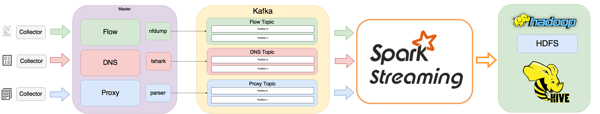

Open-Network-Insight Ingest Framework
======
Ingest data is captured or transferred into the Hadoop cluster, where they are transformed and loaded into solution data stores

## Getting Started

### Prerequisites
* [oni-setup](https://github.com/Open-Network-Insight/oni-setup)
* [kafka-python](https://github.com/dpkp/kafka-python)
* [oni-nfdump](https://github.com/Open-Network-Insight/oni-nfdump)
* tshark
  * [download](https://www.wireshark.org/download.html)
  * [how to install](https://github.com/Open-Network-Insight/open-network-insight/wiki/Install%20Ingest%20Prerequisites)
* [watchdog](http://pythonhosted.org/watchdog/)
* [spark-streaming-kafka-0-8-assembly_2.11](http://search.maven.org/#search|ga|1|a%3A%22spark-streaming-kafka-0-8-assembly_2.11%22%20AND%20v%3A%222.0.0%22)	 
* Ingest user with sudo privileges (i.e. oni).This user will execute all the processes in the Ingest Framework also this user needs to have access to hdfs solution path (i.e. /user/oni/).

### Add Kafka Service
Ingest framework needs Kafka to work in real-time streaming. Add Kafka service using Cloudera Manager.

**_NOTE: If you are using a Cloudera Manager version < 5.4.1 you will need to add the kafka parcel manually._**

### Spark-Streaming Kafaka support.
Download [spark-streaming-kafka-0-8-assembly_2.11](http://search.maven.org/#search|ga|1|a%3A%22spark-streaming-kafka-0-8-assembly_2.11%22%20AND%20v%3A%222.0.0%22). This jar adds support for **Spark Streaming + Kafka** and needs to be downloaded in the following path : **oni-ingest/oni**

### Required Roles:

The following roles are required in all the nodes where the Ingest Framework will be runing.
* [HDFS getway (i.e. Edge Server)](https://hadoop.apache.org/docs/r2.4.1/hadoop-project-dist/hadoop-hdfs/HdfsNfsGateway.html)
* Kafka Broker

### Get the code:

     git clone https://github.com/Open-Network-Insight/oni-ingest.git

### Starting the Ingest

_Standalone mode (master and workers in the same server):_

    bash start_standalone_ingest.sh "data type (flow|dns|proxy)" "num of workers"

_Cluster mode:_

**Running Master:** Master needs to be run in the same server where the collector path is.

    python master_collector.py -t "data type (i.e. flow)" -w "number of workers"
    
**Running Workers:** Worker needs to be executed in a server where processing program is installed (i.e. nfdump), also the worker needs to be identified with a specific id, this id needs to start with 0.

example:

1. worker_0,  id = 0 
2. worker_1 , id = 1

This "id" is required to attach the worker with the kafka partition.

    python worker.py -t "data type (flow|dns|proxy)" -i "id of the worker (starts with 0)" --topic "my_topic"
    
    
